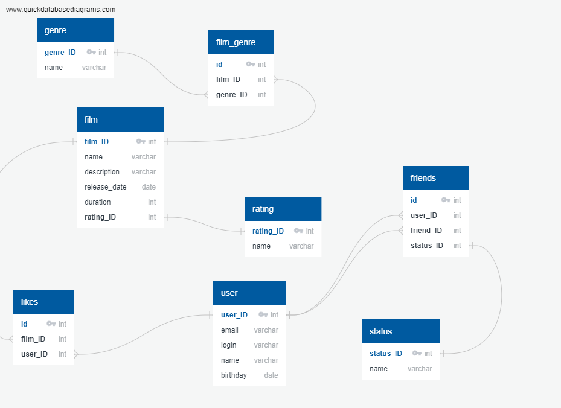

# java-filmorate

Схема: https://app.quickdatabasediagrams.com/#/d/xa5TFL

## Описание схемы базы данных

***

### ***Схема базы данных состоит их следующих таблиц***

* `user`- Информация о пользователях.
* `film`- Информация о фильмах.
* `genre`- Информация о жанрах фильмов.
* `film_genre`- Связи между фильмами и их жанрами.
* `rating`- Информация о рейтинге Ассоциации кинокомпаний.
* `likes`- Лайки пользователей к фильмам.
* `friends`- Информация о друзьях.
* `status`- Информация о дружбе между пользователями.

***